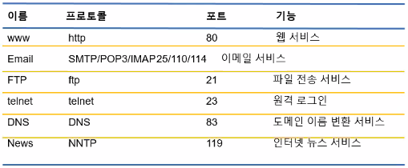

# 210115 Python, HTTP 프로토콜, Django 설치 및 실행

# 1교시

파이썬 클래스 변수 설명

# 2교시

## Web 동작 방식

1. Client에서 http 프로토콜(head와 body로 구성)로 Server로 Request
   - header: POST https://요청url; name=value 등 쌍으로 보냄
   - body: email=wansang93@naver.com&password=Pa$$w0rd
2. Server에서 웹 서버 또는 서버 프로그래밍에서 http 프로토콜 해석 및 처리
   - Front 프로그래밍
   - 요청 데이터 validcheck
   - event 처리
   - server API 호출(axios)
4. Application Server
   - email=request.getparameter("email")
   - password=request.getparameter("password")
   - businesslogic 호출, DAO(Data Access Object) 호출
   - 결과값 (viewselect 응답)
5. Server에서 http 프로토콜로 Client에 Response
   - `HTTP1.1 OK 200; contentType="text.html"; name=value; name=value ...` -> HTML
   - `HTTP1.1 OK 200; contentType="text/plain"; name=value; name=value ...` -> JSON

## Monolitic vs MSA

프로그램 관리가 쉬워짐

# 3교시

Python products MVC 프레임워크로 만들어 보기

# 4~5교시

## TCP/IP 프로토콜 중 HTTP 프로토콜



- HTTP Request methods 보기 링크 -> [모질라/docs/Web/HTTP/Methods](https://developer.mozilla.org/en-US/docs/Web/HTTP/Methods)
  - HTTP Header Docs 보기 링크 -> [모질라/docs/Web/HTTP/Headers](https://developer.mozilla.org/en-US/docs/Web/HTTP/Headers)
- HTTP Response Status Code 보기 링크 -> [모질라/docs/Web/HTTP/Status](https://developer.mozilla.org/en-US/docs/Web/HTTP/Status)

## 쿠키와 세션

HTTP 특징 중 stateless: 사용자의 상태정보를 안가지고 있음, 빠르게 응답 가능

로그인 시 사용자 정보를 유지 HTML - hidden 으로 정보 유지

Netscape 사의 Cookie 개념 도입(local Browser에 저장)

로그인에 관련된 쿠키와 세션 간단한 개념
1. Client에서 Server로 request
2. Server에서 새로운 Cookie 생성
3. Server는 Cookie 기반으로 Session관리(Cookie와 Session은 엄연히 다름)
4. Server에서 Client로 response(Cookie 값, SeesionID만 등)
5. Client에서 Cookie 받고 정보 저장

쿠키와 세션의 차이(출처 링크 -> [라이언 서버](https://interconnection.tistory.com/74))
- 쿠키와 세션은 비슷한 역할을 하며, 동작원리도 비슷합니다. 그 이유는 세션도 결국 쿠키를 사용하기 때문입니다.
- 가장 큰 차이점은 사용자의 정보가 저장되는 위치입니다. 때문에 쿠키는 서버의 자원을 전혀 사용하지 않으며, 세션은 서버의 자원을 사용합니다.
보안 면에서 세션이 더 우수하며, 요청 속도는 쿠키가 세션보다 더 빠릅니다. 그 이유는 세션은 서버의 처리가 필요하기 때문입니다.
- 보안, 쿠키는 클라이언트 로컬에 저장되기 때문에 변질되거나 request에서 스니핑 당할 우려가 있어서 보안에 취약하지만 세션은 쿠키를 이용해서 sessionid 만 저장하고 그것으로 구분해서 서버에서 처리하기 때문에 비교적 보안성이 좋습니다.
라이프 사이클, 쿠키도 만료시간이 있지만 파일로 저장되기 때문에 브라우저를 종료해도 계속해서 정보가 남아 있을 수 있다. 또한 만료기간을 넉넉하게 잡아두면 쿠키삭제를 할 때 까지 유지될 수도 있다.
- 반면에 세션도 만료시간을 정할 수 있지만 브라우저가 종료되면 만료시간에 상관없이 삭제된다.
- 속도, 쿠키에 정보가 있기 때문에 서버에 요청시 속도가 빠르고 세션은 정보가 서버에 있기 때문에 처리가 요구되어 비교적 느린 속도를 낸다.

쿠키 보안 권고: HttpOnly(JavaScirpt로 조작을 막기), SecureCookie(Https 프로토콜에서만 읽기 가능)

HTTP-Request

# 6교시

# 장고(Django) 설치

장고 튜토리얼 링크 -> [https://docs.djangoproject.com/en/3.1/intro/tutorial01/](https://docs.djangoproject.com/en/3.1/intro/tutorial01/)

[참고]웹 프레임워크 순위 랭킹 링크 -> [https://hotframeworks.com/](https://hotframeworks.com/)

Django 설치를 위해서 가상환경을 설정합니다.

## 가상환경 만들고 가상환경 실행하기

1. 기본적으로 git bash(리눅스 명령어 쉘)와 Visual Studio Code(VSCode)가 설치되어 있어야 합니다.
   - Git bash: Linux 명령어로 처리하려고 하기 때문에 필수 입니다. 윈도우 명령어에 익숙하면 윈도우 명령어를 쓰셔도 됩니다.
   - vscode: IDE로 소스코드와 터미널을 쉽고 한번에 볼 수 있습니다.
2. VSCode에 터미널에 들어갑니다.

   ```bash
   # 1. 원하는 폴더에 들어가서 가상환경 만들 준비하기
   $ pwd
   # /c/Users/wansang/Desktop/Gitrep/Cloud_Multicampus/part01-web
   # 2. 가상머신 설치하기(이름: djangovenv)
   $ python -m venv djangovenv
   # 3. 설치 확인하기
   $ ls  # djangovenv가 만들어져 있어야 함
   # 4. activate 하기
   $ source djangovenv/Scripts/activate  # activate가 되면 (djangovenv)가 뜹니다.
   # 참고로 윈도우에서 activate 하려면 `./djangovenv/Scripts/activate.bat` 으로 실행
   # 5. deactivate 하기
   $ deactivate
   ```

   이로서 가상환경 설정이 완료 되었습니다.

3. (옵션)activate 단순화 하기

   매번 가상환경을 `source djangovenv/Scripts/activate`로 실행하기에는 길기 때문에  
   `activate`라는 간결한 문자를 써서 사용하고 싶으면 리눅스의 `alias` 기능을 사용하면 됩니다.

   1. `./bashrc`를 생성 및 수정합니다.
      ```bash
      $ vi ~/.bashrc  # c드라이브에 .bashrc를 만들어서 관리를 합니다.
      export PATH="/c/Python/Python3.8.3;/c/Python/Python3.8.3/Scripts:$PATH"
      alias python="winpty python"
      alias activate="source djangovenv/Scripts/activate"
      ```
   2. 수정이 잘 되었으면 `python`, `activate`가 각각 잘 입력되는지 확인합니다.
      ```bash
      $ python  # `Ctrl + z`로 나오기
      $ activate  # `deactivate`로 나오기
      ```
   
## 장고 가상환경에 설치하기

```bash
# 기본적으로 이 화면에서 ->
(djangovenv)  # 1. 가상환경 실행인지 확인
wansang@DESKTOP-1SDB1US MINGW64 ~/Desktop/Gitrep/Cloud_Multicampus/part01-web/day10_Django (master)
# 2. 파이썬 버전 확인
$ python --version  # Python 3.8.3
# 3. 장고 설치
$ pip install Django
# 4. 장고 버전 확인
$ python -m django --version
```

## 장고 프로젝트 생성

project_name으로 프로젝트 만들기

```bash
$ django-admin startproject {project_name}
```

## 장고 앱 생성

app_name으로 앱 만들기

```bash
$ python manage.py startapp {app_name}
```

## 장고 실행

`manage.py` 가 있는 경로로 들어가서

```bash
$ cd {project_name}
$ python manage.py runserver
# localhost:8000 으로 접속하면 실행 되어 있음
```

## 장고 튜토리얼1 해보기

장고 튜토리얼1 링크 -> [https://docs.djangoproject.com/en/3.1/intro/tutorial01/](https://docs.djangoproject.com/en/3.1/intro/tutorial01/)
