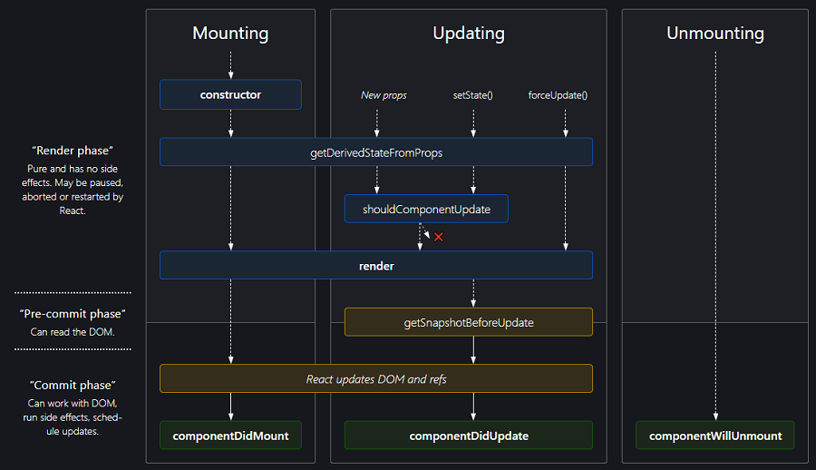

# 210303 React

# 1교시 복습

# 2교시 State와 생명주기

TODO: 여기 추가하기

## State

TODO: 여기 추가하기

## 컴포넌트 생명주기

- React.Component Link -> [https://reactjs.org/docs/react-component.html](https://reactjs.org/docs/react-component.html)

컴포넌트는 두 종류의 생명주기(Lifecycle)이 있음
- 마운팅 생명주기(Mounting Lifecycle): 컴포넌트 생성(Mounting), 제거(Unmounting)될 때 호출되는 콜백 메소드
- 갱신 생명주기(Updating Lifecycle): 컴포넌트 상태 변경, 상위 컴포넌트로부터 새로운 프로퍼티를 받을 경우 호출되는 콜백 메소드들


> [react-lifecycle-methods-diagram offical](https://projects.wojtekmaj.pl/react-lifecycle-methods-diagram/)

# 3~8교시 도서 목록

도서 목록 사이트 만들기 순서

1. 도서 목록은 google 공유 드라이브에 업로드
2. 기본적으로 Semantic UI React 사이트를 참고
   1. Grid 나누기
   2. 이미지 보여주기
   3. TODO: 여기 채우기

## React UI 

React UI 보기 검색 -> [https://www.npmjs.com/search?q=react%20ui](https://www.npmjs.com/search?q=react%20ui)

그중에 Semantic UI React의 기능들을 사용할꺼임

Semantic UI React 설치 참고 링크 -> [https://react.semantic-ui.com/usage/](https://react.semantic-ui.com/usage/)

### 1. Semantic UI React 설치하기

```cmd
yarn add semantic-ui-react semantic-ui-css --save
```

설치 후 index.js에 추가하기

```javascript
import 'semantic-ui-css/semantic.min.css'
```

### 2. Semantic UI -> Grid -> Columns

Grid/Columns Link -> [https://react.semantic-ui.com/collections/grid/#content-columns](https://react.semantic-ui.com/collections/grid/#content-columns)

```javascript

```

### 3. Semantic UI -> View -> Items

views/types-items Link -> [https://react.semantic-ui.com/views/item/#types-items](https://react.semantic-ui.com/views/item/#types-items)

```javascript

```

- TODO: 빈칸 추가하기
- TODO: 여기 내용 추가하기
- TODO: 2, 3 props, state 추가하기
- TODO: 선생님 코드 분석하기
  - 어제 코드도 연습해보기
